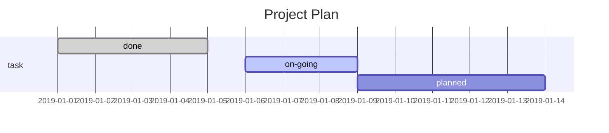

:::tip
Markdown 可以大幅提高码字效率...
:::

<!-- more -->

## 1. 标题

在想要设置为标题的文字前面加#来表示
一个`#`是一级标题，两个`#`是二级标题，以此类推，支持六级标题。

注：标准语法在`#`后跟一个空格

示例：

# 这是一级标题

## 这是二级标题

### 这是三级标题

#### 这是四级标题

##### 这是五级标题

###### 这是六级标题

## 2. 字体

- **加粗**
  要加粗的文字左右分别用两个\*号包起来

- _斜体_
  要倾斜的文字左右分别用一个\*号包起来

- **_斜体加粗_**
  要倾斜和加粗的文字左右分别用三个\*号包起来

- ~~删除线~~
  要加删除线的文字左右分别用两个~~号包起来

示例：

**这是加粗的文字**  
_这是倾斜的文字_  
**_这是斜体加粗的文字_**  
~~这是加删除线的文字~~

## 3. 引用

在引用的文字前加 `>` 即可。引用也可以嵌套，如加两个 `>>` 三个 `>>>`
n 个...

示例：

> 这是引用的内容
>
> > 这是引用的内容
> >
> > > > > > > > > > 这是引用的内容

## 4. 分割线

三个或者三个以上的 `-` 或者 `*` 都可以，显示效果是一样的。

示例：略

## 5. 图片

语法：

```


图片alt就是显示在图片下面的文字，相当于对图片内容的解释。
图片title是图片的标题，当鼠标移到图片上时显示的内容。title可加可不加
```

示例：

```

```

## 6. 超链接

语法：

```
[超链接名](超链接地址 "超链接title")
title可加可不加
```

示例：

```
[简书](http://jianshu.com)
[百度](http://baidu.com)
```

注：Markdown 本身语法不支持链接在新页面中打开，如果想要在新页面中打开的话可以用 html 语言的 a 标签代替。

```
<a href="超链接地址" target="_blank">超链接名</a>

示例
<a href="https://www.jianshu.com/u/1f5ac0cf6a8b" target="_blank">简书</a>
```

## 7. 列表

- **无序列表**  
  语法：
  无序列表用 - + \* 任何一种都可以

```
- 列表内容
+ 列表内容
* 列表内容

注意：- + * 跟内容之间都要有一个空格
```

- **有序列表**  
  语法：数字加点

```
1. 列表内容
2. 列表内容
3. 列表内容

注意：序号跟内容之间要有空格

```

- **列表嵌套**  
  **上一级和下一级之间敲三个空格即可**

## 8. 表格

语法：

```
| 表头 | 表头  | 表头 |
| ---- | :---: | ---: |
| 内容 | 内容  | 内容 |
| 内容 | 内容  | 内容 |
```

第二行分割表头和内容。

- 有一个就行，为了对齐，此处多加了几个，文字默认居左
- 两边加：表示文字居中
- 右边加：表示文字居右  
  注：原生的语法两边都要用 | 包起来。此处省略

示例：


| 姓名 | 技能  | 排行 |
| ---- | :---: | ---: |
| 刘备 |  哭   | 大哥 |
| 关羽 |  打   | 二哥 |
| 张飞 |  骂   | 三弟 |


注：各编辑器有差异

**效果如下：**

姓名|技能|排行
刘备|哭|大哥
关羽|打|二哥
张飞|骂|三弟

## 9. 代码

语法：单行代码：代码之间分别用一个反引号包起来

```
`代码内容`

```

代码块：代码之间分别用三个反引号包起来，且两边的反引号单独占一行

````
(```)
  代码...
  代码...
  代码...
(```)
````

注：为了防止转译，前后三个反引号处加了小括号，实际是没有的。这里只是用来演示，实际中去掉两边小括号即可。

示例：  
单行代码

```
`create database hero;`
```

代码块

````
(```)
    function fun(){
         echo "这是一句非常牛逼的代码";
    }
    fun();
(```)
````

**效果如下**：

单行代码  
`create database hero;`

代码块

```
function fun(){
  echo "这是一句非常牛逼的代码";
}
fun();
```

## 10. 流程图

VsCode 安装 Markdown Preview Enhanced 插件，然后右键预览。或者用 Typora (支持不同主题颜色)   
   
本文使用的是 [ vuepress-plugin-flowchart ](https://flowchart.vuepress.ulivz.com) 插件语法，仅支持流程图，不支持甘特图和时序图。

**语法：**

- 流程图

````
@flowstart
st=>start: Start|past:>http://www.google.com[blank]
e=>end: End|future:>http://www.google.com
op1=>operation: My Operation|past
op2=>operation: Stuff|current
sub1=>subroutine: My Subroutine|invalid
cond=>condition: Yes
or No?|approved:>http://www.google.com
c2=>condition: Good idea|rejected
io=>inputoutput: catch something...|future

st->op1(right)->cond
cond(yes, right)->c2
cond(no)->sub1(left)->op1
c2(yes)->io->e
c2(no)->op2->e
@flowend
````

@flowstart
st=>start: Start|past:>http://www.google.com[blank]
e=>end: End|future:>http://www.google.com
op1=>operation: My Operation|past
op2=>operation: Stuff|current
sub1=>subroutine: My Subroutine|invalid
cond=>condition: Yes
or No?|approved:>http://www.google.com
c2=>condition: Good idea|rejected
io=>inputoutput: catch something...|future

st->op1(right)->cond
cond(yes, right)->c2
cond(no)->sub1(left)->op1
c2(yes)->io->e
c2(no)->op2->e
@flowend
   

- 甘特图  
```

Typora 生成：


- 时序图
```
```sequence
Title:connection
client->server: request
server->client: response
client->server: call

```
Typora 生成：

